# ynabUp
An Up Bank → YNAB transaction sync service, written in Go.



See [HLSD.md](HLSD.md) for the architecture and design reasoning, and
[TODO.md](TODO.md) for the current backlog.

## Configuration

Copy the variables below into a `.env` file in the project root (or set
them in the environment directly — `.env` is optional, loaded via
[godotenv](https://github.com/joho/godotenv) if present).

| Variable | Required | Description |
|---|---|---|
| `UP_API_TOKEN` | yes | Up personal access token, from the [Up developer portal](https://developer.up.com.au/) |
| `YNAB_BUDGET_ID` | yes | The budget's ID (visible in its YNAB web app URL) |
| `YNAB_API_TOKEN` | yes | A YNAB personal access token (Account Settings → Developer Settings) |
| `UP_ACCOUNT_MAP` | yes | JSON object mapping each Up account ID to the YNAB account ID it syncs into — see below |
| `UP_WEBHOOK_SECRET` | only for `-serve` | The secret returned when registering an Up webhook (see below) |
| `DB_PATH` | no (default `sync.db`) | Path to the SQLite file tracking sync state |
| `PORT` | no (default `8080`) | Port `-serve` listens on |
| `CRON_INTERVAL` | no (default `1h`) | How often the reconciliation pass runs in `-serve` mode, as a Go duration (`30m`, `2h`, ...) |
| `YNAB_SAVINGS_ACCOUNT_IDS` | no | Comma-separated YNAB account IDs that should bump `YNAB_SAVINGS_CATEGORY_ID` when a linked transfer lands in them |
| `YNAB_SAVINGS_CATEGORY_ID` | no | The YNAB category funded by the above |

`UP_ACCOUNT_MAP` is a JSON object of `"<up-account-id>": "<ynab-account-id>"`
pairs, e.g.:

```json
{"222e1edc-...": "e478350d-...", "33d9ec07-...": "2112c8b2-..."}
```

Mapping more than one Up account is what makes internal transfers between
them (e.g. Spending ↔ Saver) detectable and linkable — see
[HLSD.md](HLSD.md) for why that matters. Both IDs are visible via Up's and
YNAB's own APIs (`GET /accounts` on each).

### Getting an Up webhook secret

Only needed for `-serve` mode. Register a webhook against your deployed
`/webhooks/up` URL:

```
curl -X POST https://api.up.com.au/api/v1/webhooks \
  -H "Authorization: Bearer $UP_API_TOKEN" \
  -H "Content-Type: application/json" \
  -d '{"data":{"attributes":{"url":"https://your-domain/webhooks/up"}}}'
```

The response includes a `secretKey` — that's `UP_WEBHOOK_SECRET`.

## Running

```
go run . [flags]
```

- No flags: runs a single incremental sync and exits (suitable for an
  external scheduler).
- `-serve`: runs an HTTP server (`/webhooks/up` for Up's webhook,
  `/healthz` for a liveness/last-sync check) plus an in-process
  reconciliation loop, and keeps running.

The service has no TLS termination of its own and expects to sit behind a
reverse proxy — `docker-compose.yml` binds it to `127.0.0.1:8080` for
exactly that reason.

## Testing

```
go test ./...
```

## Deployment

See `Dockerfile` and `docker-compose.yml` for the container build; secrets
are passed via `env_file` and sync state lives in a named volume.
